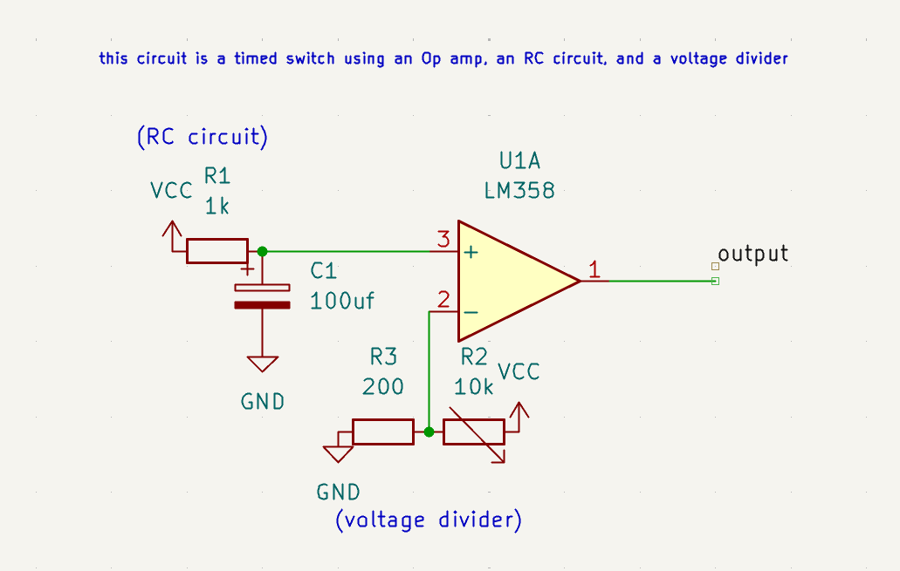
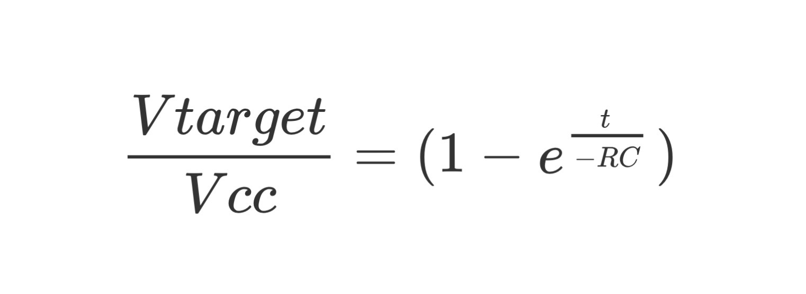
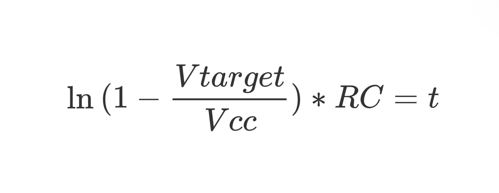

**Op amp timed switch**

**Components used:**
   *∙1x 100uF capacitor*
   *∙1x 1K resistor*
   *∙1x 200ohm resistor* 
   *∙1x 10K variable resistor*
   *∙1x Lm358(any op amp can be used)*

This is a timed switch which relies on the RC circuit where the voltage is fed into
the non-inverting input of an op amp.
The inverting input is hooked up to a variable voltage divider to set the trigger threshold
voltage, where a lower thershold voltage will lead to a faster triggering time

**Capacitor Voltage over time simulation**

**Calculating time until trigger**

*the equation is rearranged to*

*after plugging in the values, t = 52.2ms*

**Signal measurment**

*Blue plot is the RC circuit voltage over time*

*yellow plot is the Op amp Vout voltage over time*

with the given circuit and set threshold voltage the time untill trigger takes 51.8ms
